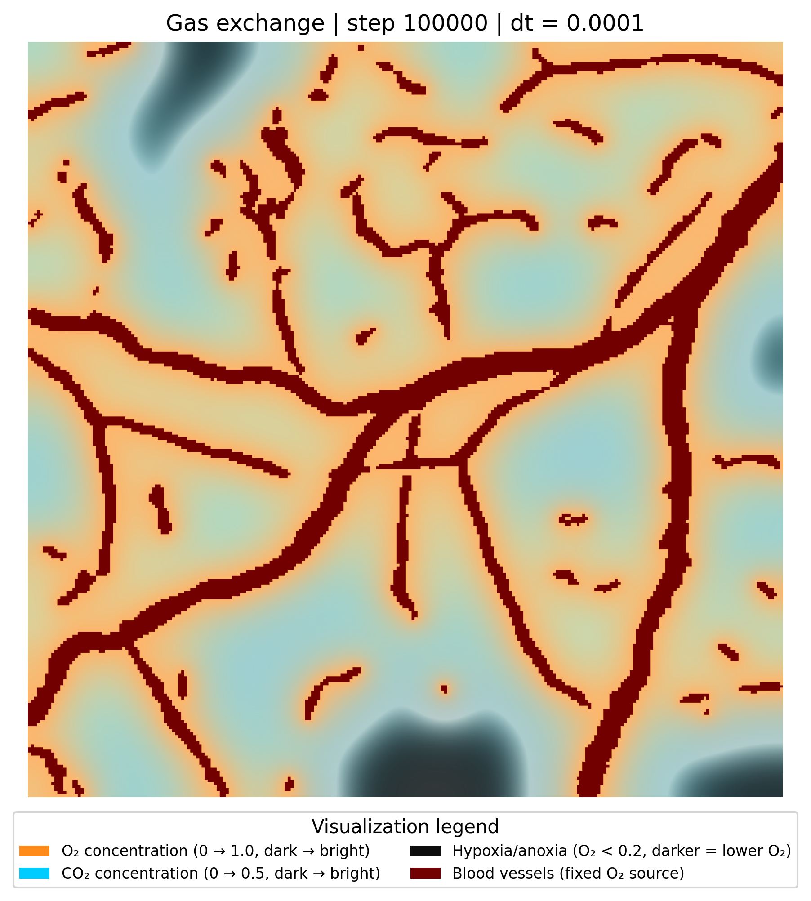
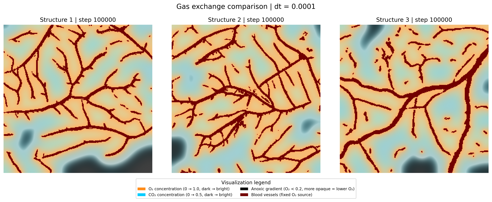

# TissueTransport

A computational framework for simulating molecular diffusion and transport in biological tissues using finite difference methods. The project models species transport through heterogeneous tissue environments while accounting for porosity, tortuosity, effective diffusivity, and vascular source regions.

## Overview

Biological function depends on transport. Oxygen delivery, carbon dioxide removal, nutrient exchange, drug penetration, and tissue survival emerge from interactions between vascular architecture, diffusion, metabolism, and flow. Small differences in vessel structure can create drastically different local microenvironments, including hypoxic or anoxic regions that influence tissue behavior.

TissueTransport aims to model these processes computationally using GPU-accelerated reaction-diffusion simulations, segmented vascular structures, and biologically motivated transport assumptions. The long-term objective is to move beyond static diffusion simulations toward dynamic vascular remodeling, where hypoxic regions drive angiogenesis and new capillary growth alters transport behavior over time.

Current workflow:

```text
Vascular image
↓
VeSeg segmentation
↓
Binary vessel mask
↓
Coupled O₂ / CO₂ transport
↓
Hypoxia / anoxia emergence
↓
Future: angiogenic remodeling
```

Current implementation:

- Coupled O₂/CO₂ transport with metabolism
- GPU-accelerated reaction-diffusion solving
- VeSeg vascular segmentation integration
- Hypoxia visualization and sensitivity analysis
- Validation against CPU reference solvers

Long-term goals:

- Blood flow and advection
- Angiogenesis and capillary sprouting
- Dynamic vascular remodeling
- Coupled hemodynamics and transport

---

## Dependencies and Setup

This project uses both Python and Rust. Python handles image processing, simulation setup, visualization, and benchmarking. Rust/WGPU handles the accelerated reaction-diffusion solver and exposes it back to Python through a NumPy-compatible extension module.

Required tools:

- Python 3.13 or compatible Python 3.x version
- Rust and Cargo
- A GPU supported by WGPU/Metal/Vulkan/DirectX/OpenGL backend support
- A Python virtual environment
- `maturin` for building the Rust extension into the Python environment

Python dependencies include:

- `numpy`
- `matplotlib`
- `tqdm`
- `pillow`
- `veseg` (machine learning-based vascular segmentation)

Install Python dependencies inside a virtual environment:

```bash
python -m venv .venv
source .venv/bin/activate
python -m pip install numpy matplotlib tqdm pillow maturin
python -m pip install git+https://github.com/HARDIntegral/VeSeg.git
```

On macOS or Linux, the virtual environment should appear in the terminal prompt before running the project:

```bash
(.venv)
```

VeSeg is installed separately because TissueTransport uses pretrained U-Net vessel segmentation before transport simulation:

```bash
python -m pip install git+https://github.com/HARDIntegral/VeSeg.git
```

This provides:

```text
vascular image
↓
VeSeg segmentation
↓
binary vessel mask
↓
TissueTransport diffusion domain
```

---

## VeSeg Integration

TissueTransport now integrates directly with **[VeSeg](https://github.com/HARDIntegral/VeSeg)**, a standalone installable Python package for machine learning-based vascular segmentation.

Pipeline:

```text
Raw vascular image
↓
VeSeg (U-Net inference)
↓
Binary vessel mask
↓
Upscaling to simulation resolution
↓
GPU reaction-diffusion solver
↓
Coupled O₂ / CO₂ transport
```

This removes dependence on handcrafted thresholding pipelines and allows biologically realistic vessel structures extracted from microscopy or histology images to act as transport boundary conditions.

The current workflow:

```text
Microscopy / vessel image
→ VeSeg segmentation
→ Binary vascular mask
→ TissueTransport simulation domain
→ GPU accelerated O₂ / CO₂ transport
```

VeSeg masks become fixed vascular source regions inside the transport solver, allowing learned vascular geometry to directly influence emergent oxygen gradients, carbon dioxide accumulation, and hypoxic regions.

---

## Building the Rust/WGPU Python Extension

The Rust GPU solver lives inside:

```bash
simulation/gpu_solver
```

Build and install the Rust extension into the active Python virtual environment:

```bash
cd simulation/gpu_solver
maturin develop --release --features python
```

Then return to the project root:

```bash
cd ../..
```

Verify that Python can import the compiled solver:

```bash
python -c "import gpu_solver; print(gpu_solver)"
```

If the import succeeds, the Python side can call the Rust/WGPU solver through:

```python
gpu_solver.run_gas_exchange_steps_auto_numpy(...)
```

---

## Running the Simulation

From the project root, run the main simulation script:

```bash
python simulation/main.py
```

This will:

- load a vascular image and generate vessel masks using the VeSeg segmentation package
- create the tissue domain
- simulate coupled O₂ diffusion, CO₂ production, and metabolism through the Rust/WGPU solver
- treat vessels as persistent O₂ sources and CO₂ sinks
- save diffusion visualizations and final concentration maps

The main simulation uses chunked GPU execution. Instead of returning to Python every timestep, many intermediate timesteps stay inside Rust/GPU memory before a sampled frame is returned for plotting or GIF generation.

---

## Running Tests

Rust solver tests are located in:

```bash
simulation/gpu_solver/tests
```

Run all Rust tests from the GPU solver directory:

```bash
cd simulation/gpu_solver
cargo test
```

To check the Python feature build without producing a full optimized extension:

```bash
cargo check --features python
```

To check the optimized Python-enabled build:

```bash
cargo check --release --features python
```

The tests validate the CPU fallback, WGPU solver behavior, vessel reset logic, Michaelis-Menten consumption, and equivalence against reference outputs.

---

## Running Benchmarks

After building the Python extension with `maturin`, run the benchmark script from the project root:

```bash
python simulation/benchmark.py
```

The benchmark compares:

- NumPy-optimized Python reference solver
- Rust/WGPU solver called through the Python NumPy interface

The script performs one warmup run for each solver and excludes it from the reported statistics. This helps remove one-time initialization overhead from GPU pipeline setup, shader compilation, memory allocation, and caching. It then records five measured runs, calculates mean execution time, standard deviation, per-run speedups, and saves the performance plot as:

```bash
benchmark_performance.png
```

---

## Mathematical Model

Diffusion is modeled using Fick's Law:

$$\mathbf{J}=-D_{\mathrm{eff}}\nabla C$$

where:

- $\mathbf{J}$: flux vector
- $D_{\mathrm{eff}}$: effective diffusivity
- $C$: concentration

Concentration evolution:

$$\frac{\partial C}{\partial t}=-\nabla\cdot\mathbf{J}$$

Effective diffusivity depends on local tissue properties:

$$D_{\mathrm{eff}}=D\frac{\epsilon}{\tau}$$

where:

- $D$: intrinsic diffusivity
- $\epsilon$: porosity
- $\tau$: tortuosity

---

## Metabolic Oxygen Consumption

Oxygen consumption is modeled using Michaelis-Menten kinetics:

$$R(C)=\frac{V_{max}C}{K_m+C}$$

where:

- $V_{max}$: maximum oxygen consumption rate
- $K_m$: concentration at half-maximal consumption
- $C$: local oxygen concentration

The governing equation becomes:

$$\frac{\partial C}{\partial t}=D\nabla^2 C-\frac{V_{max}C}{K_m+C}$$

which creates biologically realistic steady-state oxygen gradients around vascular networks.

---

## Long-Term Vision

The long-term objective of TissueTransport is to evolve from a diffusion simulator into a GPU-accelerated computational physiology framework capable of simulating coupled gas exchange, metabolism, vascular adaptation, and biologically realistic tissue transport using vascular networks extracted directly from imaging data. The current workflow already integrates the standalone VeSeg machine learning package to segment vascular structures before transport simulation.

Planned biological extensions include angiogenesis,
dynamic vascular remodeling, and machine learning-based vessel segmentation from microscopy images.

---

## Modeling Assumptions

Current simulations assume:

- Tissue behaves as a homogeneous porous medium
- Diffusion occurs in two spatial dimensions
- Temperature remains constant during simulation
- Vessel oxygen concentration is fixed
- Blood flow and advection are neglected
- Diffusion is isotropic within local tissue regions
- Tissue metabolism follows Michaelis-Menten kinetics
- Carbon dioxide is produced proportionally to oxygen consumption
- Vascular geometry is generated through VeSeg, a pretrained U-Net segmentation package for vessel extraction

---

## Diffusion Dynamics

The visualizations below show how concentration gradients emerge over time from the interaction between vascular geometry, diffusion, and metabolic consumption. Vessel masks generated through VeSeg act as fixed source regions, while transport and consumption shape spatial heterogeneity throughout the tissue.

<table>
<tr>
<td align="center"><b>Original vessel structure</b></td>
<td align="center"><b>Transport dynamics over time</b></td>
</tr>
<tr>
<td>

</td>
<td>

</td>
</tr>
</table>

Observed behavior:

- Strong concentration gradients emerge around vascular regions
- Poorly perfused regions develop depletion zones over time
- Spatial heterogeneity arises directly from vessel architecture
- Steady-state behavior reflects competition between diffusion, consumption, and source replenishment

---

## Coupled Oxygen and Carbon Dioxide Transport

The current solver advances oxygen and carbon dioxide simultaneously. Oxygen is consumed through Michaelis-Menten metabolism while carbon dioxide is generated as a metabolic byproduct. Vessel regions act as fixed oxygen sources and carbon dioxide sinks.

The visualization below shows steady-state coupled gas transport after long simulation times.


Observed behavior:

- Oxygen remains elevated near vessel regions and depleted in poorly perfused tissue
- Carbon dioxide accumulates where oxygen consumption is sustained
- Vascular regions remain low in CO₂ due to sink boundary conditions
- Emergent gradients arise from coupled metabolism and diffusion rather than diffusion alone

The comparison below shows steady-state coupled gas exchange across three different segmented vascular structures. Differences in vessel density, branching, and spatial distribution produce distinct oxygen penetration depths, carbon dioxide accumulation patterns, and hypoxic regions.



Observed behavior:

- Denser vascular networks maintain broader oxygenated regions
- Sparse or uneven vascular distributions produce larger hypoxic zones
- Carbon dioxide accumulation depends on both metabolism and local oxygen availability
- Transport behavior emerges from vascular morphology rather than diffusion alone

Note: Oxygen concentrations remain dominant near vascular regions because vessels are modeled as fixed concentration sources, continuously replenishing O₂ at each timestep. In contrast, CO₂ is generated indirectly through metabolic consumption and lacks a persistent source term, causing accumulation patterns to emerge farther from vessel boundaries despite local production rates increasing with oxygen availability.

---

## Parameter Sensitivity Analysis

Steady-state oxygen distributions were compared across different Michaelis-Menten parameters.

Columns vary:

- $V_{max}$: maximum oxygen consumption

Rows vary:

- $K_m$: oxygen affinity of tissue metabolism

Increasing $V_{max}$ strengthens depletion and sharpens gradients, while changing $K_m$ modifies how strongly low-oxygen regions consume oxygen.

The purpose of these sweeps is to determine parameter regimes that produce biologically plausible oxygen penetration depths and hypoxic regions.


This is effectively a sensitivity analysis of the transport model and helps calibrate consumption parameters against expected tissue behavior.

---

## CPU vs GPU Performance Benchmark

The Rust/WGPU implementation was benchmarked against the original NumPy-optimized Python reference solver using identical reaction-diffusion simulations on a $1000\times1000$ grid. Performance measurements were repeated across multiple runs and summarized with average execution time, standard deviation, and per-run variability.


Observed behavior:

- The Rust/WGPU solver consistently outperformed the NumPy-based implementation
- Variability between runs remained small after initialization overhead was removed
- GPU acceleration becomes increasingly beneficial as spatial resolution increases
- Larger grids benefit from keeping timesteps and buffers resident on the GPU rather than repeatedly transferring arrays

**Benchmark note:** One preliminary warmup run was intentionally excluded from the reported statistics for each solver. This allows initialization costs such as GPU pipeline creation, shader compilation, memory allocation, and caching overhead to stabilize before measuring steady-state performance.

**Hardware note:** Benchmark results shown here were generated on a local development machine using a MacBook Pro with Apple Silicon (M5) and the integrated Apple GPU through Metal/WGPU. Absolute timings and speedups will vary across hardware, operating systems, GPU architectures, driver implementations, and backend support. These measurements are intended to demonstrate relative performance gains and scaling behavior rather than establish universal benchmark values.

---

## GPU Optimization and Validation Workflow

Performance improvements alone are not sufficient for scientific simulation. The GPU implementation was validated against the original NumPy-optimized Python reference solver throughout development to ensure numerical consistency while optimizing execution speed.

Validation process:

1. **Reference implementation**
	- The original explicit finite-difference solver was preserved as a CPU baseline (`solver_reference/`)
	- All new GPU logic was compared against this implementation rather than replacing it directly

2. **Numerical equivalence testing**
	- Identical concentration fields, diffusivity maps, vessel masks, and Michaelis-Menten parameters were supplied to both solvers
	- Output concentrations were compared after multiple timesteps
	- Center-cell concentrations and absolute error metrics were monitored during optimization

3. **Incremental optimization**
	- Initial GPU implementations suffered from repeated buffer allocation and CPU↔GPU transfer overhead
	- Persistent buffers and batched timestep execution were introduced to minimize readbacks
	- Double buffering allowed concentration fields to alternate between GPU buffers without intermediate copies

4. **Fallback verification**
	- A CPU fallback path remains available when compatible GPU hardware is unavailable
	- GPU and CPU paths share equivalent validated physics models

5. **Benchmarking under realistic workloads**
	- Benchmarks were performed on large grids ($1000\times1000$) to evaluate scaling behavior
	- Warmup runs were excluded to remove one-time initialization costs
	- Variability, standard deviation, and average speedups were recorded across repeated runs


---

## Related Projects

- **[VeSeg](https://github.com/HARDIntegral/VeSeg)**
  - Standalone machine learning package for vascular segmentation
  - Uses pretrained U-Net inference to generate binary vessel masks from microscopy or vascular images
  - Integrated into TissueTransport as the vascular preprocessing and source-region generation pipeline

---

## License

This project is distributed under the MIT License.

See the [LICENSE](LICENSE) file for additional details regarding permissions, limitations, and usage.
