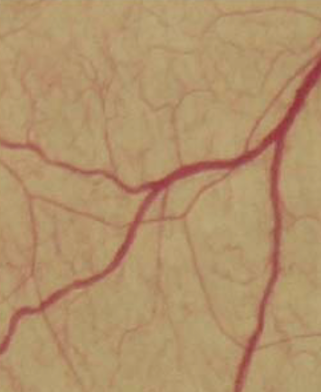
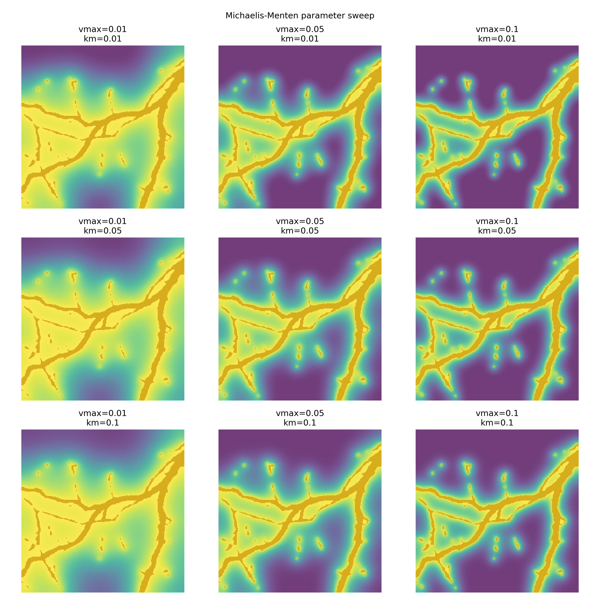
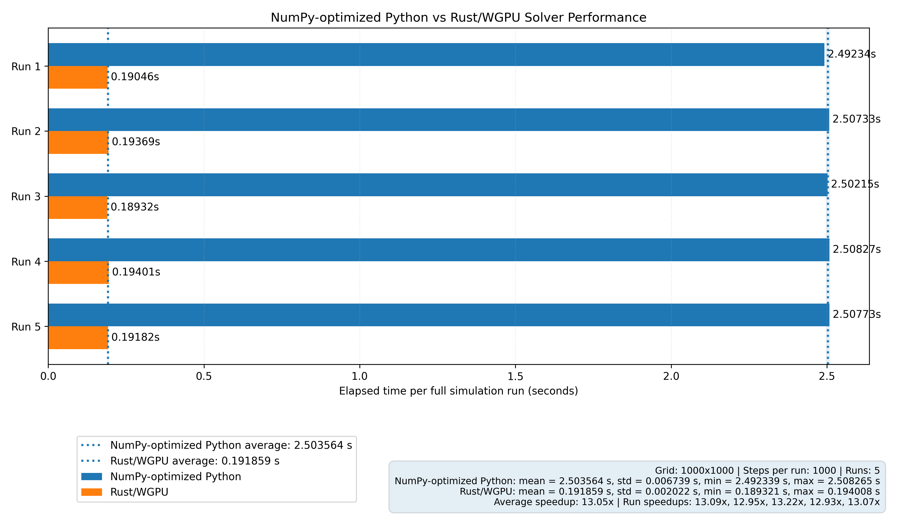

# TissueTransport

A computational framework for simulating molecular diffusion and transport in biological tissues using finite difference methods. The project models species transport through heterogeneous tissue environments while accounting for porosity, tortuosity, effective diffusivity, and vascular source regions.

## Overview

Transport phenomena govern oxygen delivery, nutrient exchange, and drug penetration in biological tissues. This project aims to simulate these processes numerically using discretized diffusion equations and customizable tissue properties.

Current implementation includes:

- 2D diffusion simulation
- Spatially varying effective diffusivity
- Tissue porosity ($\epsilon$) effects
- Tortuosity ($\tau$) effects
- Temperature-dependent diffusivity
- Fixed vascular concentration sources
- Explicit finite difference time stepping
- Flux and flux divergence calculations
- Species-specific transport properties
- Michaelis-Menten oxygen consumption
- GPU acceleration
- GIF generation for diffusion dynamics
- Parameter sensitivity analysis

Future goals:

- Blood flow and advection
- Vessel wall permeability
- 3D tissue domains
- Multi-species transport
- Reaction-diffusion systems
- Visualization/interactive simulations
- Vessel radius-dependent oxygen delivery
- Coupled angiogenesis and hypoxia models
- Adaptive mesh refinement
- Hemodynamic flow coupling
- 3D GPU acceleration
- Experimental parameter fitting against biological data

---

## Dependencies and Setup

This project uses both Python and Rust. Python handles image processing, simulation setup, visualization, and benchmarking. Rust/WGPU handles the accelerated reaction-diffusion solver and exposes it back to Python through a NumPy-compatible extension module.

Required tools:

- Python 3.13 or compatible Python 3.x version
- Rust and Cargo
- A GPU supported by WGPU/Metal/Vulkan/DirectX/OpenGL backend support
- A Python virtual environment
- `maturin` for building the Rust extension into the Python environment

Python dependencies include:

- `numpy`
- `matplotlib`
- `tqdm`
- `pillow`

Install Python dependencies inside a virtual environment:

```bash
python -m venv .venv
source .venv/bin/activate
python -m pip install numpy matplotlib tqdm pillow maturin
```

On macOS or Linux, the virtual environment should appear in the terminal prompt before running the project:

```bash
(.venv)
```

---

## Building the Rust/WGPU Python Extension

The Rust GPU solver lives inside:

```bash
simulation/gpu_solver
```

Build and install the Rust extension into the active Python virtual environment:

```bash
cd simulation/gpu_solver
maturin develop --release --features python
```

Then return to the project root:

```bash
cd ../..
```

Verify that Python can import the compiled solver:

```bash
python -c "import gpu_solver; print(gpu_solver)"
```

If the import succeeds, the Python side can call the Rust/WGPU solver through:

```python
gpu_solver.run_steps_auto_numpy(...)
```

---

## Running the Simulation

From the project root, run the main simulation script:

```bash
python simulation/main.py
```

This will:

- load and preprocess the vessel image
- create the tissue domain
- run oxygen diffusion and consumption through the Rust/WGPU solver
- save the diffusion animation as `oxygen_diffusion.gif`
- run the Michaelis-Menten parameter sweep
- save the parameter sweep as `parameter_sweep.png`

The main simulation uses chunked GPU execution. Instead of returning to Python every timestep, many intermediate timesteps stay inside Rust/GPU memory before a sampled frame is returned for plotting or GIF generation.

---

## Running Tests

Rust solver tests are located in:

```bash
simulation/gpu_solver/tests
```

Run all Rust tests from the GPU solver directory:

```bash
cd simulation/gpu_solver
cargo test
```

To check the Python feature build without producing a full optimized extension:

```bash
cargo check --features python
```

To check the optimized Python-enabled build:

```bash
cargo check --release --features python
```

The tests validate the CPU fallback, WGPU solver behavior, vessel reset logic, Michaelis-Menten consumption, and equivalence against reference outputs.

---

## Running Benchmarks

After building the Python extension with `maturin`, run the benchmark script from the project root:

```bash
python simulation/benchmark.py
```

The benchmark compares:

- NumPy-optimized Python reference solver
- Rust/WGPU solver called through the Python NumPy interface

The script performs one warmup run for each solver and excludes it from the reported statistics. This helps remove one-time initialization overhead from GPU pipeline setup, shader compilation, memory allocation, and caching. It then records five measured runs, calculates mean execution time, standard deviation, per-run speedups, and saves the performance plot as:

```bash
benchmark_performance.png
```

---

## Mathematical Model

Diffusion is modeled using Fick's Law:

$$\mathbf{J}=-D_{\mathrm{eff}}\nabla C$$

where:

- $\mathbf{J}$: flux vector
- $D_{\mathrm{eff}}$: effective diffusivity
- $C$: concentration

Concentration evolution:

$$\frac{\partial C}{\partial t}=-\nabla\cdot\mathbf{J}$$

Effective diffusivity depends on local tissue properties:

$$D_{\mathrm{eff}}=D\frac{\epsilon}{\tau}$$

where:

- $D$: intrinsic diffusivity
- $\epsilon$: porosity
- $\tau$: tortuosity

---

## Metabolic Oxygen Consumption

Oxygen consumption is modeled using Michaelis-Menten kinetics:

$$R(C)=\frac{V_{max}C}{K_m+C}$$

where:

- $V_{max}$: maximum oxygen consumption rate
- $K_m$: concentration at half-maximal consumption
- $C$: local oxygen concentration

The governing equation becomes:

$$\frac{\partial C}{\partial t}=D\nabla^2 C-\frac{V_{max}C}{K_m+C}$$

which creates biologically realistic steady-state oxygen gradients around vascular networks.

---

## Modeling Assumptions

Current simulations assume:

- Tissue behaves as a homogeneous porous medium
- Diffusion occurs in two spatial dimensions
- Temperature remains constant during simulation
- Vessel oxygen concentration is fixed
- Blood flow and advection are neglected
- Diffusion is isotropic within local tissue regions
- Tissue metabolism follows Michaelis-Menten kinetics

---

## Oxygen Diffusion Dynamics

The animation below shows oxygen diffusing outward from segmented blood vessels into surrounding tissue while metabolism continuously removes oxygen.

<table>
<tr>
<td align="center"><b>Original vessel structure</b></td>
<td align="center"><b>Oxygen diffusion over time</b></td>
</tr>
<tr>
<td>

</td>
<td>

</td>
</tr>
</table>

Observed behavior:

- High oxygen concentration near vessels
- Hypoxic regions in poorly vascularized tissue
- Emergence of steady-state concentration gradients
- Competition between diffusion and metabolic consumption

---

## Parameter Sensitivity Analysis

Steady-state oxygen distributions were compared across different Michaelis-Menten parameters.

Columns vary:

- $V_{max}$: maximum oxygen consumption

Rows vary:

- $K_m$: oxygen affinity of tissue metabolism

Increasing $V_{max}$ strengthens depletion and sharpens gradients, while changing $K_m$ modifies how strongly low-oxygen regions consume oxygen.

The purpose of these sweeps is to determine parameter regimes that produce biologically plausible oxygen penetration depths and hypoxic regions.



This is effectively a sensitivity analysis of the transport model and helps calibrate consumption parameters against expected tissue behavior.

---

## CPU vs GPU Performance Benchmark

The Rust/WGPU implementation was benchmarked against the original NumPy-optimized Python reference solver using identical reaction-diffusion simulations on a $1000\times1000$ grid. Performance measurements were repeated across multiple runs and summarized with average execution time, standard deviation, and per-run variability.



Observed behavior:

- The Rust/WGPU solver consistently outperformed the NumPy-based implementation
- Variability between runs remained small after initialization overhead was removed
- GPU acceleration becomes increasingly beneficial as spatial resolution increases
- Larger grids benefit from keeping timesteps and buffers resident on the GPU rather than repeatedly transferring arrays

**Benchmark note:** One preliminary warmup run was intentionally excluded from the reported statistics for each solver. This allows initialization costs such as GPU pipeline creation, shader compilation, memory allocation, and caching overhead to stabilize before measuring steady-state performance.

**Hardware note:** Benchmark results shown here were generated on a local development machine using a MacBook Pro with Apple Silicon (M5) and the integrated Apple GPU through Metal/WGPU. Absolute timings and speedups will vary across hardware, operating systems, GPU architectures, driver implementations, and backend support. These measurements are intended to demonstrate relative performance gains and scaling behavior rather than establish universal benchmark values.

---

## GPU Optimization and Validation Workflow

Performance improvements alone are not sufficient for scientific simulation. The GPU implementation was validated against the original NumPy-optimized Python reference solver throughout development to ensure numerical consistency while optimizing execution speed.

Validation process:

1. **Reference implementation**
	- The original explicit finite-difference solver was preserved as a CPU baseline (`solver_reference/`)
	- All new GPU logic was compared against this implementation rather than replacing it directly

2. **Numerical equivalence testing**
	- Identical concentration fields, diffusivity maps, vessel masks, and Michaelis-Menten parameters were supplied to both solvers
	- Output concentrations were compared after multiple timesteps
	- Center-cell concentrations and absolute error metrics were monitored during optimization

3. **Incremental optimization**
	- Initial GPU implementations suffered from repeated buffer allocation and CPU↔GPU transfer overhead
	- Persistent buffers and batched timestep execution were introduced to minimize readbacks
	- Double buffering allowed concentration fields to alternate between GPU buffers without intermediate copies

4. **Fallback verification**
	- A CPU fallback path remains available when compatible GPU hardware is unavailable
	- GPU and CPU paths share equivalent validated physics models

5. **Benchmarking under realistic workloads**
	- Benchmarks were performed on large grids ($1000\times1000$) to evaluate scaling behavior
	- Warmup runs were excluded to remove one-time initialization costs
	- Variability, standard deviation, and average speedups were recorded across repeated runs

This workflow helps ensure that performance gains do not come at the expense of physical correctness. The original reference solver remains part of the project as validation infrastructure rather than being discarded after optimization.
